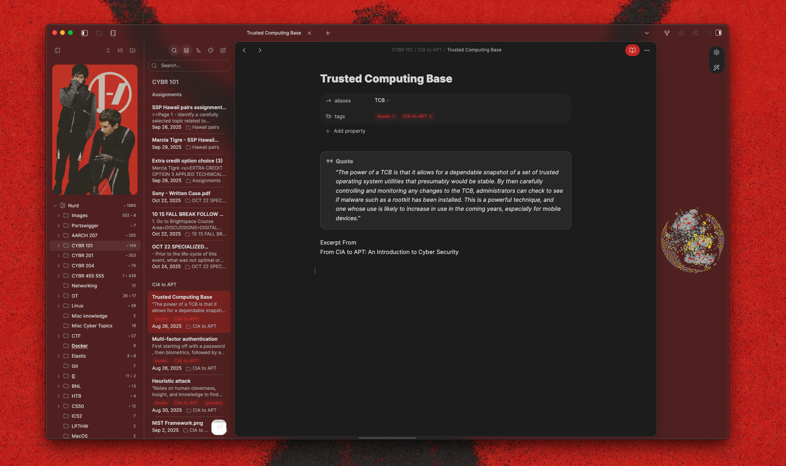

  <h2>Sorted by community plugin</h2>
  <h5><em>Style-settings</em></h5>
  <a href="https://github.com/johansan/notebook-navigator">Notebook Navigator</a> + <a href="https://github.com/aaaaalexis/obsidian-baseline">Baseline</a>

  

  【Preview】
  

    <h4>Get started</h4>
To apply these settings simply download the `data.json` file in this repo and replace the same file inside of the `.obsidian/obsidian-style-settings` in the desired obsidian vault or just copy and paste it in the Style-settings GUI

