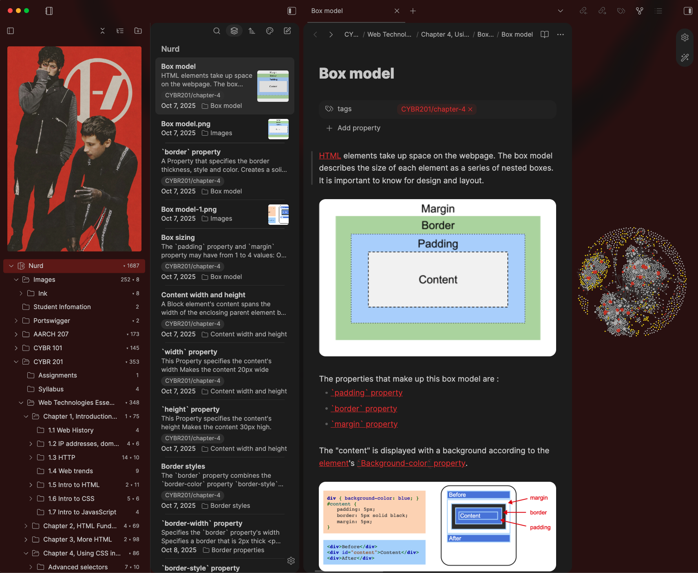

## Sorted by community plugin
##### *Style-settings*

<a href="https://github.com/johansan/notebook-navigator">Notebook Navigator</a> + <a href="https://github.com/aaaaalexis/obsidian-baseline">Baseline</a>

【Preview】

    

      <b>How-to:</b>
    

    
To apply these settings simply download the `data.json` file in this repo and replace the same file inside of the `.obsidian/obsidian-style-settings` in the desired obsidian vault or just copy and paste it in the Style-settings GUI
    

