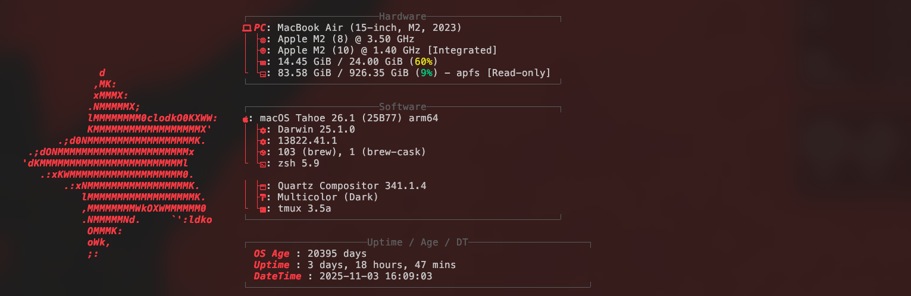

  

【Preview】
  

<h4>Get started</h4>
  
In order to properly use this configuration you will <b><em>need</em></b> to change the path used in the `.jsonc` file to the absolute path of the ASCII star art shown in the example (which is inside of this repository) or whatever ASCII you may have. If this is not done, the ASCII art will not appear if the command is run in any location other than the location of the configuration file (as it references the current directory as its location.)

<h4>Change glyphs</h4>
  
In order to get different glyphs shown (Like if you want to use a Linux or Windows Glyph instead of the Apple glyph in this config) go to the following website and search for your desired glyph:<a href="https://www.nerdfonts.com/cheat-sheet"> Nerd fonts cheat-sheet</a> and simply replace/substitute it in inside of the configuration file since it's just a text/font character.

<h4>Changing the colors</h4>
  
Follow this color format guide in order to change the colors to your preferences: <a href="https://github.com/fastfetch-cli/fastfetch/wiki/Color-Format-Specification">Fastfetch color format specification on Github</a>
  

